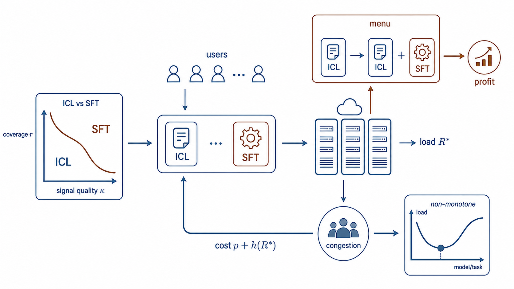
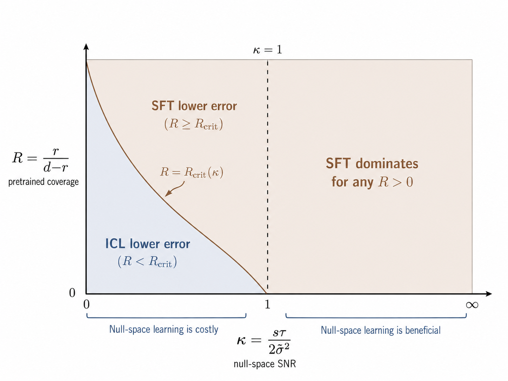
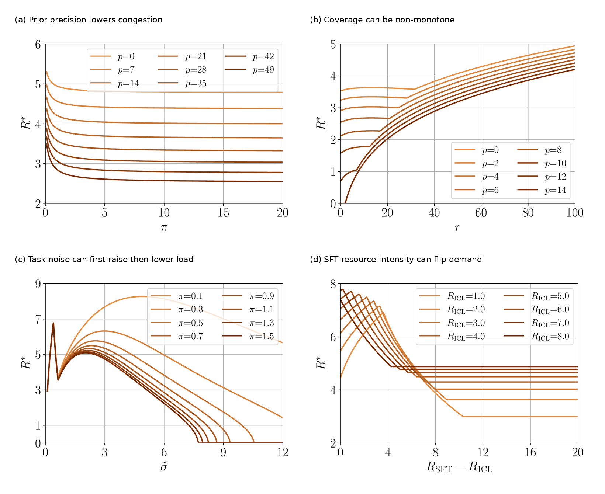
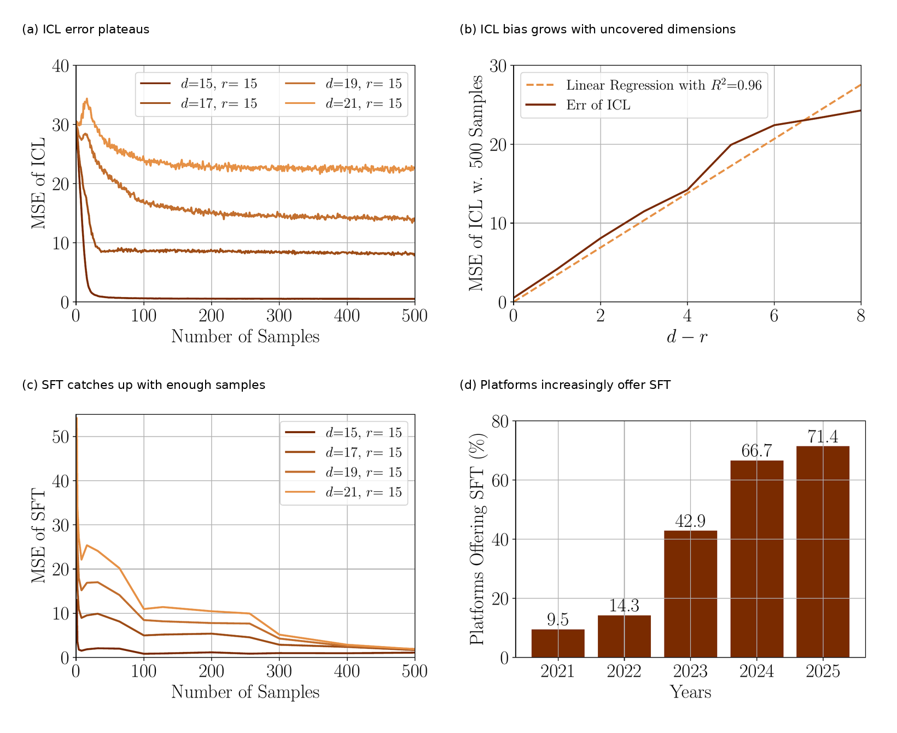

# Supervised Fine-Tuning vs. In-Context Learning:  An Equilibrium Analysis of LLM Personalization under Congestion
> Authors: Fengzhuo Zhang, Zhuoran Yang, Dirk Bergemann  

<figure></figure>

**Figure 1. Teaser map of the project.** LLM personalization across many users forms a closed loop: users choose whether lightweight In-Context Learning (ICL) or compute-intensive Supervised Fine-Tuning (SFT) is attractive, based on the pretrained model, their desired task, and prevailing GPU congestion. These individual choices aggregate into shared GPU congestion, which in turn feeds back into the cost of personalization. Our contribution is to model this full loop: statistical personalization quality, equilibrium compute demand, and algorithm menus.

## TL;DR

Personalization makes LLMs more useful, but it also consumes scarce shared compute. Once many users personalize models on the same infrastructure, their choices create congestion: one user's fine-tuning job can increase the waiting cost faced by everyone else.

The main contribution of our paper is a tractable  statistical--economic framework for this problem. It connects how ICL and SFT learn, how users  choose  between them under shared compute, and how platforms should price and design  personalization menus. The main message is:

- **Algorithm performance is governed by the coverage and signal quality.** ICL adapts within the topics covered by pretraining, while SFT can learn from user-specific data across both covered and uncovered topics. The linear model captures this distinction by separating the subspace covered by pretraining from the uncovered subspace. This separation reveals the key tradeoff between ICL and SFT: SFT dominates when the uncovered subspace carries sufficiently strong signal-to-noise; ICL dominates when those directions are too noisy to learn reliably.
- **Congestion turns the SFT–ICL comparison into an economic problem.** Users each choose a personalization method and a sample size for personalization. These choices create aggregate compute demand for platforms, and we prove that the resulting equilibrium congestion level is uniquely pinned down, even when users can mix between algorithms.
- **Serving load can move non-monotonically with problem parameters.** Through users’ equilibrium choices, the higher prior precision reduces the congestion level, but broader pretraining coverage, harder tasks, or more expensive SFT can raise or lower congestion through the interaction between sample intensity and algorithm switching.
- **Offering both ICL and SFT is profit-safe for the platform.** From the platform’s perspective, raising congestion prices reduces equilibrium demand, and offering both ICL and SFT never lowers maximal platform profit in the model relative to a lightweight ICL-only menu. This helps explain why major LLM platforms increasingly offer both options.

## 1. Why personalization is an economic problem

A pretrained LLM carries broad general knowledge, but many valuable uses are **local**: they require domain-specific knowledge, such as financial analysis over proprietary documents, legal reasoning over case records, clinical decision support, coding over a private repository, or customer support in a specialized domain. In these settings, performance depends not only on the base model, but also on how well the service adapts to the user’s task. That adaptation is personalization. Platforms typically support two routes.

**In-Context Learning (ICL)** puts examples, instructions, or retrieved documents into the prompt. ICL adapts behavior at inference time without changing model parameters. It is flexible and comparatively cheap, but its gains are tied to what the pretrained model can already represent.

**Supervised Fine-Tuning (SFT)** updates the model parameters using task-specific data. SFT can make adaptation more persistent and can learn beyond the directions already covered by pretraining, but it is compute-heavy because it requires gradient back propagation, parameter updates, and optimizer-state storage.

For a single user with unlimited resources, the natural technical question is: *Which method has lower prediction error?* For an LLM service, that question is incomplete. When many users personalize models on shared infrastructure, each personalization decision also changes aggregate resource demand. A fine-tuning job that improves one user’s model can consume scarce compute that others also rely on. That is why personalization is an economic problem: **the right method depends jointly on learning quality and on the congestion created by compute-intensive adaptation.**

## 2. A light statistical model of personalization

We use a linear abstraction to isolate the mechanism. A user’s personalization task is represented by a hidden parameter $\theta^\star \in \mathbb{R}^d$. Personalization data consist of noisy covariate-response pairs $\{(\tilde x_i,\tilde y_i)\}_{i=1}^{\tilde N}$, where $\tilde x_i\in\mathbb{R}^d$ and $\tilde y_i\in\mathbb{R}$ for $i\in[\tilde N]$:
  
$$
\tilde y_i = \tilde x_i^\top \theta^\star + \tilde\epsilon_i,
\qquad
\tilde\epsilon_i \sim \mathcal{N}(0,\tilde\sigma^2).
$$

Here, $d$ denotes the task dimension, and $\tilde\sigma^2$ measures the noise level in the user's personalization data. Each covariate $\tilde x_i$ represents a query, e.g., ''United States''; the task parameter $\theta^\star$ encodes the relationship between queries and responses, e.g., ''capital of''; and the response $\tilde y_i$ is the corresponding answer, e.g., ''Washington, D.C.'' The pretrained model induces a learned prior over a wide range of tasks represented in the corpus. In other words, pretraining yields a task prior,
$$
\widehat\theta_{\mathrm{pre}} \sim \mathcal{N}(\theta_{\mathrm{pre}},\Sigma_{\mathrm{pre}}).
$$

The key object is the pretraining coverage subspace induced by $\Sigma_{\mathrm{pre}}$. If $\mathrm{rank}(\Sigma_{\mathrm{pre}})=r<d$, then pretraining covers only $r$ effective directions of the downstream task space. Directions outside this subspace are not represented by the pretrained prior.

#### ICL: Bayesian updating inside the subspace covered by pretraining

ICL directly prompts the pretrained model with the personalization data ${(\tilde x_i,\tilde y_i)}_{i=1}^{\tilde N}$ without changing the model parameters. Conceptually, ICL internally updates the LLM’s belief from the learned prior $\mathcal{N}(\theta_{\mathrm{pre}},\Sigma_{\mathrm{pre}})$ to the corresponding posterior after observing the personalization data. Specifically, in the linear model, the posterior mean is

$$
\theta_{\mathrm{ICL}}
=
\theta_{\mathrm{pre}}
+
\Sigma_{\mathrm{pre}}\tilde X^\top
\bigl(\tilde X\Sigma_{\mathrm{pre}}\tilde X^\top+\tilde\sigma^2 I\bigr)^{-1}
\bigl(\tilde Y-\tilde X\theta_{\mathrm{pre}}\bigr).
$$

This expression is useful because it exposes a limitation: ICL updates through $\Sigma_{\mathrm{pre}}$. If a task direction is outside the support of the pretrained prior, ICL cannot substantially move in that direction. It is conservative.

#### SFT: regularized movement away from pretraining

SFT adapts the pretrained model by tuning its parameters on user-specific personalization data. We model this process as a regularized estimator centered at the pretrained model:

$$
\theta_{\mathrm{SFT}}
=
\arg\min_{\theta\in\mathbb{R}^d}
\frac{1}{\tilde\sigma^2}\lVert \tilde Y-\tilde X\theta\rVert_2^2
+
\lambda \lVert \theta-\theta_{\mathrm{pre}}\rVert^2_{\Sigma_{\mathrm{pre}}^\dagger}.
$$

The regularization term $\lVert \theta-\theta_{\mathrm{pre}}\rVert^2_{\Sigma_{\mathrm{pre}}^\dagger}$ reflects that SFT is anchored at the pretrained model. The regularization parameter $\lambda$ controls how strongly fine-tuning stays close to the pretrained parameter. Unlike ICL, SFT can learn directions outside the pretraining-covered subspace, but this flexibility becomes risky when the user data are scarce or noisy.

## 3. The SFT--ICL Phase Diagram

The comparison between SFT and ICL is governed by two ideas: pretraining coverage and the signal quality of the user’s data. Coverage asks how much of the downstream task the pretrained model already represents. Signal quality asks whether the user’s examples are informative enough to teach the model what pretraining missed.

The paper derives a clear threshold rule. SFT is preferred when coverage and data quality make it worthwhile to learn beyond the pretrained model. ICL is preferred when the uncovered parts of the task are too noisy to estimate reliably. Put simply: SFT is more adventurous, while ICL is more conservative.

<figure></figure>

**Figure 2. SFT--ICL phase diagram.** SFT is favored by high pretraining coverage and high data quality; ICL is favored when the uncovered directions are noisy and insufficiently supported by personalization data.

> **Finding — Personalization method.** When a task is poorly covered and user data are limited or noisy, ICL can be safer because it avoids fitting unsupported patterns. With enough clean, informative data, SFT’s ability to learn what pretraining missed becomes the stronger advantage.

## 4. From One User to a Congested Platform: LLM-Serving Congestion Game of Users

We now consider a setting in which many users personalize models on the same platform. Each user chooses a personalization algorithm $a\in{\mathrm{ICL},\mathrm{SFT}}$ and the number of personalization samples $\tilde N$. The cost of a type-$t$ user under congestion level $R$ is

$$
C(t,a,\tilde N,R)
=
E_a(t,\tilde N)
+
R_a\tilde N\bigl(p+h(R)\bigr).
$$

The first term is the prediction Mean-Squared Error (MSE) of personalization method $a$ using $\tilde N$ personalization samples for a type-$t$ user. The second term is the computational cost. It is the product of the consumed resource $R_a\tilde N$ and the unit resource cost $p+h(R)$. The term $p$ reflects the intrinsic resource cost, such as the cost of electricity, while $h(R)$ captures the congestion cost, such as the waiting-time cost induced when the system congestion level is $R$. In summary, these terms have the following meanings:
- The type $t$ indexes a class of users and contains information about the task and personalization data, such as the data noise level;
- $R_a$ is the resource required per personalization sample under algorithm $a$;
- $p$ is the unit resource price set by the platform;
- $R$ is aggregate resource demand;
- $h(R)$ is the waiting cost induced by aggregate congestion $R$.

The policy $\pi_t$ of a type-$t$ user is the joint distribution over the personalization method $a$ and the corresponding personalization data size $\tilde N$. The policy profile $\pi = (\pi_t)_{t\in\mathcal T}$ collects the policies across all user types. The aggregate congestion induced by $\pi$ is:

$$
R(\pi)
=
\sum_{a\in\{\mathrm{ICL},\mathrm{SFT}\}}
R_a
\int_{\mathcal{T}}\int_0^\infty
\tilde N\,\pi_t(a,d\tilde N)\,T(dt).
$$
The distribution $T$ denotes the distribution of user types. Thus, $R(\pi)$ is the average resource demand induced by policy profile $\pi$ across the user population.

An equilibrium $\pi^\star$ is a fixed point, where users optimize given congestion, and the resulting choices reproduce that congestion:

$$
\mathrm{supp}(\pi_t^\star)
\subseteq
\arg\min_{a,\tilde N} C(t,a,\tilde N,R^\star),
\qquad
R^\star=R(\pi^\star).
$$

The paper proves that the equilibrium congestion level $R^\star$ exists and is unique. This is important: even if users can mix between ICL and SFT in multiple ways, the platform-level load is pinned down.

> **Finding — Predictable platform load.** Equilibrium user behavior need not be unique: users may choose different combinations of ICL, SFT, and sample sizes. However, the paper proves that all equilibria induce the same aggregate congestion level. Thus, for any fixed platform price, the model provides a unique prediction for aggregate demand, congestion-related latency, effective compute costs, and platform revenue.

## 5. Homogeneous Users and Non-monotone Comparative Statics

For homogeneous users, everyone faces the same effective compute cost: the platform price plus the delay created by congestion. For each method, users choose enough personalization data to balance better predictions against the extra compute bill.

This creates an algorithm-separation threshold. Below it, compute is cheap enough that users prefer SFT. Above it, they switch to the lighter ICL option. The equilibrium sits where the method users choose, the compute they consume, and the congestion they collectively create are mutually consistent.

Intuitively, high effective compute costs favor ICL, while low costs make SFT’s additional statistical gains worth paying for. The equilibrium balances better personalization against greater resource use.

<figure></figure>

**Figure 3. Equilibrium mechanism.** Low congestion makes SFT attractive; high congestion pushes users toward ICL. The equilibrium is the intersection where induced compute demand is consistent with the congestion cost users face.

Next, we ask how equilibrium congestion changes with the model’s key inputs. A natural guess is that better pretrained models should reduce personalization demand. Our model shows that this intuition is only partly correct.

Higher prior precision reduces congestion. If pretraining is more accurate in the directions it already covers, users need fewer personalization samples, as Figure 4(a) shows.

Broader pretraining coverage can increase congestion, but not monotonically. When compute is cheap, expanding coverage makes more task directions worth personalizing, so users may use more samples or switch toward SFT. At intermediate coverage, switching between ICL and SFT can reduce aggregate demand. At high coverage, personalization becomes productive across a broader space, so users scale up again. Congestion can therefore rise, fall, and rise again as coverage expands, as Figure 4(b) shows.

The same mechanism appears with task noise and SFT’s resource intensity, shown in Figure 4(c) and (d). When noise is moderate, users may spend more compute to compensate. When noise becomes too large, personalization is no longer worth it, and demand falls. Similarly, making SFT more resource-intensive can initially raise congestion before eventually pushing users toward ICL.

<figure></figure>

**Figure 4. Non-monotone congestion responses.** Equilibrium congestion decreases with prior precision, but can respond non-monotonically to pretraining coverage, personalization noise, and SFT’s relative resource intensity. The source is the interaction between how much users personalize and which method they choose.

The practical lesson is that serving load is not a simple proxy for model quality. A better pretrained model may reduce load by making personalization unnecessary, or increase load by making personalization more productive.

> **Finding — Three regimes, two margins.** Low congestion favors SFT, high congestion favors ICL, and an intermediate regime can mix the two methods to clear the compute market. Changes in model quality or cost affect both how much data users consume and which method they choose. Because those two responses can pull in opposite directions, better models or more expensive SFT do not translate mechanically into lower platform load.

## 6. Heterogeneous users and pinned equilibria

Real platforms serve heterogeneous users. Some have clean data; others have noisy data. Some tasks are close to pretraining; others are far away. Some users benefit greatly from SFT; others barely benefit. With two user types, the equilibrium has a threshold structure. At low congestion, both types choose SFT. At high congestion, both choose ICL. In the middle, one type may choose SFT while the other chooses ICL.

This creates a phenomenon we call anchoring. The equilibrium congestion level can be pinned by a marginal user type. Small changes in another group’s data quality or population share may leave total congestion unchanged, because the marginal type absorbs the change by adjusting how often it chooses ICL rather than SFT.

In the flat region shown below, congestion is anchored by the second user type. Changes in the first group’s noise or population share do not move aggregate load. Economically, flat demand does not necessarily mean users are insensitive; it may mean the system is sitting at a switching threshold.

<figure></figure>

**Figure 5. Pinned equilibria with heterogeneous users.** The dark region marks combinations of the first group’s population share and noise level for which equilibrium congestion is locally flat. In this region, aggregate load is pinned by the marginal switching type.

> **Finding — Why congestion can look insensitive.** Flat congestion arises in two economically different cases. A marginal group may be exactly indifferent between ICL and SFT, allowing its mixing behavior to absorb small changes, or compute may be so costly that users stop buying personalization data. Once the system crosses a switching threshold, however, a small change can produce a sharp shift in method adoption and load.

## 7. Platform design: pricing and algorithm menus

The platform first sets a unit resource price. Users then choose how to personalize, producing an equilibrium level of compute demand. Platform profit is the markup over unit compute cost multiplied by that demand. The model gives two platform-design results.

First, congestion pricing works: lower prices increase equilibrium resource use, while higher prices reduce it. A higher price raises the marginal cost of personalization, so users use fewer samples or substitute toward lighter methods.

Under the paper’s regularity conditions, the profit-maximizing price is finite. At sufficiently high prices, users scale personalization back so sharply that demand—and eventually even ICL usage—collapses. Raising price forever therefore cannot maximize profit.

Second, adding SFT to an ICL-only platform does not reduce maximal profit. Since SFT is the compute-heavy method, adding it either leaves resource demand unchanged or increases it. The platform can still optimize its price, so expanding the menu is profit-safe in the model.

This does not mean SFT is always socially optimal: it can increase congestion. But from the platform’s perspective, offering algorithmic diversity is attractive.

> **Finding — Pricing and menus.** Higher prices reliably reduce compute demand, but the platform optimally stops short of pricing personalization out of the market. When SFT is genuinely more compute-intensive than ICL, adding it to the menu cannot reduce the platform’s best attainable profit, although it may increase congestion. This is a profit result, not a claim that the larger menu always improves social welfare.

## 8. Empirical Validation

We validate our model using a 22M-parameter GPT-2 model trained on linear regression tasks with deliberately incomplete pretraining coverage. This setup is designed to test the theory directly: pretraining covers 15 task dimensions, while downstream tasks may be larger.

The results match the model:

- ICL error decreases with more examples but eventually plateaus.
- The plateau grows approximately linearly with the number of task dimensions that pretraining does not cover; that relationship explains about 96 percent of the variation in the experiment.
- SFT performs worse when only a few samples are available, but can outperform ICL with hundreds of samples.
- Across 21 major AI platforms, the share offering SFT rises from 9.5% in 2021 to 71.4% in 2025.

<figure></figure>

**Figure 6. Empirical validation.** The GPT-2 experiments reproduce the theory’s statistical predictions: ICL has an uncovered-dimension bias floor, while SFT improves with sufficient data. The platform evidence is consistent with the menu-design result that offering both ICL and SFT is profit-safe.

> **Finding — Evidence for both sides of the tradeoff.** The experiment recovers both margins predicted by the model: ICL’s error floor tracks what pretraining failed to cover, while the SFT–ICL ranking flips as the amount of personalization data grows. The platform survey shows a parallel rise in mixed ICL–SFT menus; it is consistent with the theory.

## 9. Takeaways

**For users, personalization is both a statistical and a congestion decision.** Coverage and data quality determine which method fits the task; congestion determines what is affordable. Low congestion can justify more data and SFT, while rising congestion pushes users to use fewer samples, switch to ICL, or stop personalizing—and each user’s compute use raises costs for others.

**For platforms, personalization design is congestion design.** Pricing affects not only how much compute users buy, but also which personalization method they choose. Offering SFT can improve the menu and increase profit, yet it can also attract compute-heavy workloads and raise waiting costs. A platform therefore manages a feedback loop between price, algorithm choice, and aggregate load.

**For researchers, algorithms cannot be treated as interchangeable demand shocks.** ICL and SFT learn differently, use different amounts of compute, and respond differently to congestion. Modeling those algorithmic differences is essential for predicting user behavior and system-level outcomes.

The central message is:

> LLM personalization creates a two-way feedback loop. Coverage and data quality shape users’ preferred method; those choices create shared compute congestion; and congestion feeds back into how much users personalize and whether they choose SFT, ICL, or no personalization. Platform pricing and algorithm menus govern this loop.

## Citation

Fengzhuo Zhang, Zhuoran Yang, and Dirk Bergemann. 2026. Supervised Fine-Tuning vs. In-Context Learning: An Equilibrium Analysis of LLM Personalization under Congestion. In *The 27th ACM Conference on Economics and Computation (EC ’26)*, July 6–10, 2026, Rome, Italy. ACM, New York, NY, USA, 1 page. [https://doi.org/10.1145/3821539.3827833](https://doi.org/10.1145/3821539.3827833)
