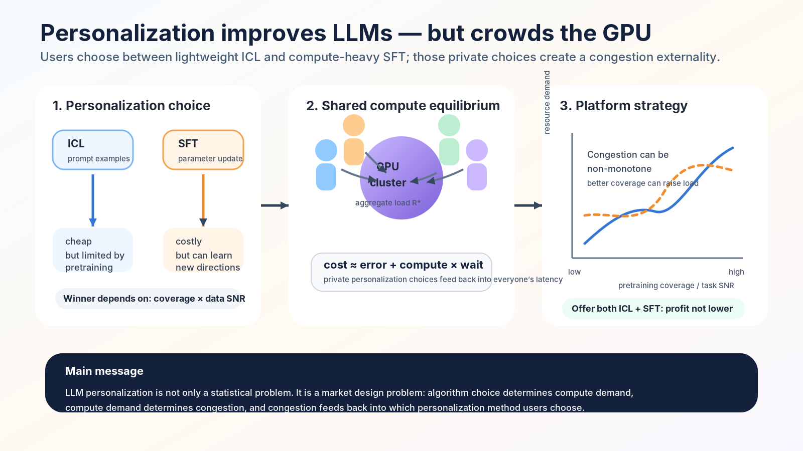
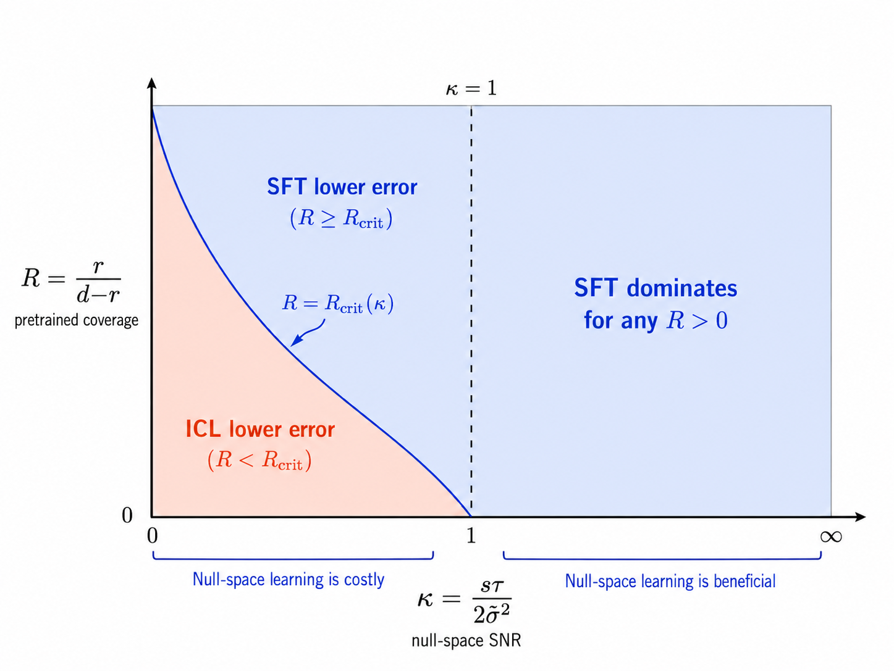
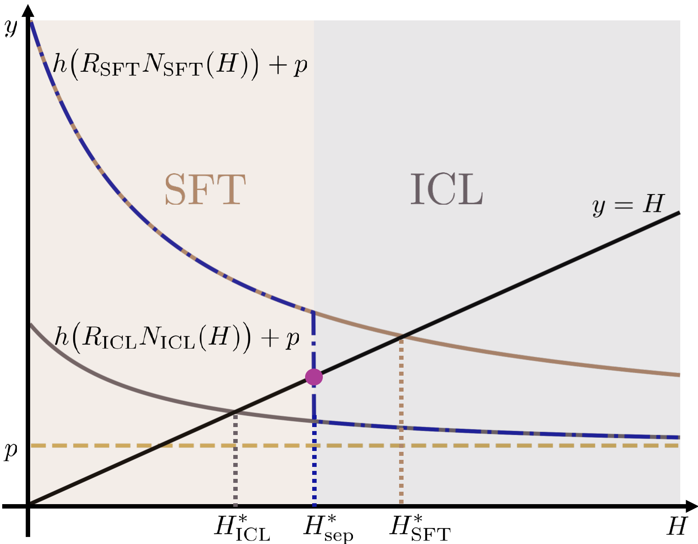
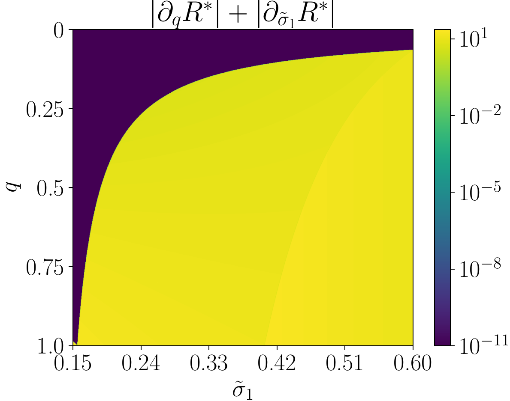

# Supervised Fine-Tuning vs. In-Context Learning:  An Equilibrium Analysis of LLM Personalization under Congestion

> Authors: Fengzhuo Zhang, Zhuoran Yang, Dirk Bergemann  
> Paper: *Supervised Fine-Tuning vs. In-Context Learning:  An Equilibrium Analysis of LLM Personalization under Congestion*



**Figure 1. Teaser.** LLM personalization is a closed loop. The pretrained model and the user task determine whether lightweight in-context learning (ICL) or compute-heavy supervised fine-tuning (SFT) is <span style="color:#b45309; font-weight:700;">attractive</span>. Individual choices then aggregate into shared GPU <span style="color:#2563eb; font-weight:700;">congestion</span>, which feeds back into the cost of personalization. The paper's contribution is to model this full loop: statistical <span style="color:#2563eb; font-weight:700;">personalization quality</span>, equilibrium compute demand, and platform pricing and algorithm menus.

## TL;DR

Personalization makes LLMs more useful, but it also consumes scarce shared compute. Once many users personalize models on the same infrastructure, their choices create congestion: one user's fine-tuning job can increase the waiting cost faced by everyone else.

The main contribution of our paper is a tractable statistical--economic <span style="color:#2563eb; font-weight:700;">framework</span> for this problem. It connects how ICL and SFT <span style="color:#b45309; font-weight:700;">learn</span>, how users choose between them under shared compute, and how platforms should price and design personalization menus. The main message is:

- Algorithm performance is governed by <span style="color:#2563eb; font-weight:700;">coverage and signal quality</span>. ICL updates within the subspace covered by pretraining, while SFT can move across the whole parameter space. This yields a threshold: SFT dominates when pretraining coverage or uncovered-subspace signal-to-noise is <span style="color:#b45309; font-weight:700;">high</span>; ICL dominates when uncovered directions are too noisy to learn reliably.
- Congestion turns the SFT--ICL comparison into an <span style="color:#2563eb; font-weight:700;">equilibrium problem</span>. Users jointly choose a personalization method and a sample size. These choices create aggregate compute demand, and the paper proves that the resulting congestion level is <span style="color:#b45309; font-weight:700;">uniquely</span> pinned down even when users can mix between algorithms.
- Serving load can move non-monotonically. Higher prior precision reduces congestion, but broader pretraining coverage, harder tasks, or more expensive SFT can raise or lower load through the interaction of sample intensity and algorithm switching.
- <span style="color:#2563eb; font-weight:700;">Platform design</span> follows from the same framework. Congestion pricing reduces equilibrium demand, and offering both ICL and SFT never lowers maximal <span style="color:#2563eb; font-weight:700;">platform profit</span> in the model, helping explain why major LLM platforms increasingly offer both options.

## 1. Why personalization is an economic problem

A pretrained LLM carries broad general knowledge, but many valuable uses are local: financial analysis over proprietary documents, legal reasoning over case records, clinical decision support, coding over a private repository, or customer support in a specialized domain. In these settings, performance depends not only on the base model, but also on how well the service adapts to the user's task. That adaptation is <span style="color:#2563eb; font-weight:700;">personalization</span>.

Platforms typically support two routes.

In-context learning (ICL). Put examples, instructions, or retrieved documents into the prompt. ICL adapts behavior at inference time without changing model parameters. It is flexible and comparatively cheap, but its gains are tied to what the pretrained model can already represent.

Supervised fine-tuning (SFT). Update model parameters using task-specific data. SFT can make adaptation more persistent and can learn beyond the directions already covered by pretraining, but it is compute-heavy because it requires gradient backpropagation, parameter updates, and optimizer-state storage.

For a single user, the natural technical question is: *which method has lower prediction error?* For an LLM service, that question is incomplete. When many users personalize models on shared infrastructure, each decision also changes aggregate resource demand. A fine-tuning job that improves one user's model can increase the waiting cost faced by others.

That is why personalization is an economic <span style="color:#2563eb; font-weight:700;">problem</span>. The right method depends <span style="color:#b45309; font-weight:700;">jointly</span> on learning quality and the congestion created by compute-intensive adaptation.

## 2. A light statistical model of personalization

We use a linear abstraction to isolate the mechanism. A user’s task is represented by a hidden parameter $\theta^\star \in \mathbb{R}^d$. Personalization data are generated as

$$
\tilde y_i = \tilde x_i^\top \theta^\star + \tilde\epsilon_i,
\qquad
\tilde\epsilon_i \sim \mathcal{N}(0,\tilde\sigma^2).
$$

Here, $d$ is the task dimension and $\tilde\sigma^2$ measures the noise in the user’s personalization data.

The pretrained model induces a learned prior,

$$
\widehat\theta_{\mathrm{pre}} \sim \mathcal{N}(\theta_{\mathrm{pre}},\Sigma_{\mathrm{pre}}).
$$

The important object is the <span style="color:#2563eb; font-weight:700;">pretraining coverage subspace</span>. If $\mathrm{rank}(\Sigma_{\mathrm{pre}})=r<d$, then pretraining covers only $r$ effective directions of the downstream task space. Directions outside this subspace are weakly represented by the pretrained model.

### ICL: Bayesian updating inside the pretrained subspace

In the linear model, ICL behaves like posterior updating under the learned prior:

$$
\theta_{\mathrm{ICL}}
=
\theta_{\mathrm{pre}}
+
\Sigma_{\mathrm{pre}}\tilde X^\top
\bigl(\tilde X\Sigma_{\mathrm{pre}}\tilde X^\top+\tilde\sigma^2 I\bigr)^{-1}
\bigl(\tilde Y-\tilde X\theta_{\mathrm{pre}}\bigr).
$$

This expression is useful because it exposes a limitation: ICL updates through $\Sigma_{\mathrm{pre}}$. If a task direction is outside the support of the pretrained prior, ICL cannot substantially move in that direction. It is conservative.

### SFT: regularized movement away from pretraining

SFT is modeled as a regularized estimator centered at the pretrained model:

$$
\theta_{\mathrm{SFT}}
=
\arg\min_{\theta\in\mathbb{R}^d}
\frac{1}{\tilde\sigma^2}\lVert \tilde Y-\tilde X\theta\rVert_2^2
+
\lambda \lVert \theta-\theta_{\mathrm{pre}}\rVert^2_{\Sigma_{\mathrm{pre}}^\dagger}.
$$

The regularization parameter $\lambda$ controls how strongly fine-tuning stays near the pretrained model. Compared with ICL, SFT can learn directions outside the pretrained subspace, but doing so is risky when user data are scarce or noisy.

## 3. The SFT--ICL phase diagram

The comparison between SFT and ICL is governed by two quantities:

$$
\mathcal{R}=\frac{r}{d-r}
\qquad \text{and} \qquad
\kappa=\frac{s\tau}{2\tilde\sigma^2}.
$$

Here, $\mathcal{R}$ is the <span style="color:#2563eb; font-weight:700;">coverage ratio</span>: how much of the task space is covered by pretraining relative to the uncovered part. The parameter $\kappa$ is the <span style="color:#2563eb; font-weight:700;">signal-to-noise ratio</span> in the uncovered subspace: it increases when personalization data are <span style="color:#b45309; font-weight:700;">informative</span> and decreases when data are noisy.

Under the isotropic specialization of the model, the paper derives a threshold rule of the form

$$
\text{SFT beats ICL}
\quad \Longleftrightarrow \quad
\mathcal{R}\geq \mathcal{R}_{\mathrm{crit}}(\kappa,\text{pretraining parameters}).
$$

When $\kappa\geq 1$, SFT dominates because the user data are informative enough to learn uncovered directions. When $\kappa<1$, ICL can win because it avoids chasing noisy signals in directions pretraining did not cover.



**Figure 2. SFT--ICL phase diagram.** The exact boundary in the paper depends on model primitives, but the qualitative message is robust: SFT is favored by high pretraining coverage and high data quality; ICL is favored when uncovered directions are noisy and poorly covered.

A compact way to remember the mechanism is:

$$
\underbrace{E_{\mathrm{ICL}}}_{\text{conservative}}
\approx
\underbrace{\frac{2\tilde\sigma^2 r}{\tilde N^\alpha + \text{prior term}}}_{\text{learned covered directions}}
+
\underbrace{(d-r)\tau}_{\text{irreducible uncovered bias}},
$$

while

$$
\underbrace{E_{\mathrm{SFT}}}_{\text{aggressive}}
\approx
\underbrace{\frac{2\tilde\sigma^2 d}{\tilde N^\alpha}}_{\text{learns all directions, but pays noise}}.
$$

ICL has a bias floor from uncovered directions. SFT has no such floor asymptotically, but it pays variance in every direction. This is the statistical <span style="color:#2563eb; font-weight:700;">heart</span> of the paper.

## 4. From one user to a congested platform

Now put many users on the same platform. Each user chooses an algorithm $a\in\{\mathrm{ICL},\mathrm{SFT}\}$ and a number of personalization samples $\tilde N$. The user cost is

$$
C(t,a,\tilde N,R)
=
E_a(t,\tilde N)
+
R_a\tilde N\bigl(p+h(R)\bigr).
$$

The first term is prediction error. The second term is compute cost. Here:

- $R_a$ is the resource required per personalization sample under algorithm $a$;
- $p$ is the unit resource price set by the platform;
- $h(R)$ is the congestion-induced waiting cost;
- $R$ is aggregate resource demand.

Aggregate congestion is generated by all users’ decisions:

$$
R(\pi)
=
\sum_{a\in\{\mathrm{ICL},\mathrm{SFT}\}}
R_a
\int_{\mathcal{T}}\int_0^\infty
\tilde N\,\pi_t(a,d\tilde N)\,T(dt).
$$

An equilibrium is a fixed point. Users optimize given congestion, and the resulting choices reproduce that congestion:

$$
\mathrm{supp}(\pi_t^\star)
\subseteq
\arg\min_{a,\tilde N} C(t,a,\tilde N,R^\star),
\qquad
R^\star=R(\pi^\star).
$$

The paper proves that the <span style="color:#2563eb; font-weight:700;">equilibrium congestion level</span> $R^\star$ exists and is <span style="color:#b45309; font-weight:700;">unique</span>. This is important: even if users can mix between ICL and SFT in multiple ways, the platform-level load is pinned down.

## 5. Equilibrium as a switching curve

For homogeneous users, the equilibrium can be summarized by an effective unit compute cost

$$
H=p+h(R).
$$

For each algorithm, users choose the optimal sample size at cost $H$:

$$
N_a(H)=\arg\min_{N\geq 0}\left\{E_a(N)+R_aNH\right\}.
$$

There is also an <span style="color:#2563eb; font-weight:700;">algorithm-separation threshold</span> $H_{\mathrm{sep}}^\star$: users prefer SFT below this threshold and ICL above it. Equilibrium clips this separator between the ICL-only and SFT-only fixed points:

$$
H^\star
=
\max\left\{H_{\mathrm{ICL}}^\star,
\min\{H_{\mathrm{sep}}^\star,H_{\mathrm{SFT}}^\star\}\right\},
\qquad
R^\star=\sqrt{H^\star-p}
$$

for the quadratic congestion example $h(R)=R^2$.



**Figure 3. Equilibrium mechanism.** Low congestion makes SFT attractive; high congestion pushes users toward ICL. The equilibrium is where the induced compute demand is consistent with the congestion cost users face.

## 6. Why better pretraining can increase congestion

A natural guess is that better models should reduce personalization demand. The model shows that this is only partly true.

Higher prior precision $\pi$ reduces congestion. If pretraining is more accurate in directions it already covers, users need fewer personalization samples. Thus $R^\star$ falls.

Broader coverage $r$ can increase congestion. More coverage means personalization becomes useful along more directions. This can increase the marginal return to personalization and induce users to spend more compute. Depending on prices and task parameters, $R^\star$ can increase, decrease, and then increase again as coverage expands.

The same mechanism appears with task noise and SFT resource intensity. Task noise can first increase demand, because users try harder to compensate, and later decrease demand, because personalization becomes too noisy to be worth it. Increasing SFT’s resource requirement can initially raise congestion before eventually pushing users to ICL.


**Figure 4. Non-monotone congestion responses.** Equilibrium congestion $R^\star$ decreases with prior precision $\pi$, but can respond non-monotonically to pretraining coverage $r$, personalization noise $\tilde\sigma$, and the relative resource intensity of SFT. The source of non-monotonicity is the interaction between the intensive margin (how many samples to use) and the extensive margin (which personalization algorithm to choose).

The practical lesson is that serving load is not a simple proxy for model quality. A better pretrained model may reduce load by making personalization unnecessary, or increase load by making personalization more productive.

## 7. Heterogeneous users and pinned equilibria

Real platforms serve heterogeneous users. Some have clean data; others have noisy data. Some tasks are close to pretraining; others are far away. Some users benefit greatly from SFT; others barely benefit.

With two user types, the equilibrium has a threshold structure. At low congestion, both types choose SFT. At high congestion, both choose ICL. In the middle, one type may choose SFT while the other chooses ICL.

This creates a phenomenon we call <span style="color:#2563eb; font-weight:700;">anchoring</span>. The equilibrium congestion level can be <span style="color:#b45309; font-weight:700;">pinned</span> by a marginal user type. Small changes in another group’s data quality or population share may not move $R^\star$, because the marginal type absorbs the change by adjusting its mixing probability between ICL and SFT.

Mathematically, this appears as a local flat region:

$$
\partial_{\tilde\sigma_1}R^\star=0,
\qquad
\partial_q R^\star=0,
$$

where $q$ is the population share of type-1 users. Economically, flat demand does not necessarily mean users are insensitive. It may mean the system is sitting at a switching threshold.



**Figure 5. Pinned equilibria with heterogeneous users.** The dark region marks parameter values where the equilibrium congestion level is locally flat with respect to both the type-1 population share $q$ and the type-1 noise level $\tilde\sigma_1$. In this region, aggregate load is pinned by the marginal switching type.

## 8. Platform design: pricing and algorithm menus

The platform first sets a unit resource price $p$. Users then reach the congestion equilibrium $R^\star(p)$. The platform profit is

$$
I(p)=(p-1)R^\star(p),
$$

where the constant $1$ is the normalized unit compute cost.

The model gives two <span style="color:#2563eb; font-weight:700;">platform-design results</span>.

First, congestion pricing works:

$$
p_1<p_2
\quad\Longrightarrow\quad
R^\star(p_2)\leq R^\star(p_1).
$$

Higher price raises the marginal cost of personalization, so users reduce sample sizes or substitute toward lighter methods.

Second, adding SFT to an ICL-only platform cannot reduce maximal profit. If $R^\star_{\mathrm{full}}(p)$ is the equilibrium congestion when both ICL and SFT are offered, and $R^\star_{\mathrm{ICL}}(p)$ is the equilibrium congestion when only ICL is offered, then the paper proves

$$
R^\star_{\mathrm{full}}(p)\geq R^\star_{\mathrm{ICL}}(p).
$$

Since SFT is the compute-heavy method, adding it either changes nothing or increases monetizable <span style="color:#2563eb; font-weight:700;">resource demand</span>. The platform can still optimize price, so expanding the menu is <span style="color:#b45309; font-weight:700;">profit-safe</span> in the model.

This does not mean SFT is always socially optimal: it can increase congestion. But from the platform’s perspective, offering algorithmic diversity is attractive.

## 9. Empirical validation

The paper validates the mechanism using a 22M-parameter GPT-2 model trained on linear regression tasks with rank-deficient <span style="color:#2563eb; font-weight:700;">pretraining coverage</span>. This setup is designed to test the theory directly: pretraining covers only $r=15$ dimensions, while downstream tasks may have larger dimension $d$.

The results match the model:

- ICL error decreases with more examples but eventually plateaus.
- The plateau grows approximately linearly with the number of uncovered dimensions $d-r$.
- SFT performs worse when samples are scarce, but catches up and can outperform ICL when enough samples are available.
- Across 21 major AI platforms, the share offering SFT rises from 9.5% in 2021 to 71.4% in 2025.


**Figure 6. Empirical validation.** The GPT-2 experiments reproduce the theory’s statistical predictions: ICL has an uncovered-dimension bias floor, while SFT improves with sufficient data. The platform evidence is consistent with the menu-design result that offering both ICL and SFT is profit-safe.

## 10. Takeaways

For users, the lesson is that the right personalization method depends on coverage and data quality. If the task is close to what the model already knows, ICL may be enough. If the task requires new directions and the user has clean data, SFT can be worth the cost.

For platforms, the lesson is that personalization design is congestion design. The platform is not simply selling tokens. It is selling access to a scarce compute system where algorithm choices determine load.

For researchers, the lesson is that LLM economics should model the algorithms themselves. ICL and SFT are not interchangeable demand shocks. They have different statistical behavior, different resource profiles, and different equilibrium effects.

The central message is:

> The economics of LLM personalization depends on the algorithms themselves. <span style="color:#2563eb; font-weight:700;">Pretraining coverage and data signal quality</span> determine the SFT--ICL tradeoff; user choices aggregate into unique, sometimes <span style="color:#b45309; font-weight:700;">non-monotone</span> <span style="color:#2563eb; font-weight:700;">compute congestion</span>; and platform pricing and algorithm menus shape the resulting market.

## Citation

```bibtex
@misc{zhang2026personalization,
  title  = {Supervised Fine-Tuning vs. In-Context Learning:  An Equilibrium Analysis of LLM Personalization under Congestion},
  author = {Fengzhuo Zhang and Zhuoran Yang and Dirk Bergemann},
  year   = {2026},
  note   = {Working paper}
}
```
